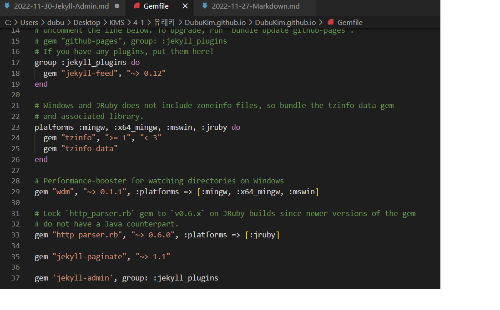
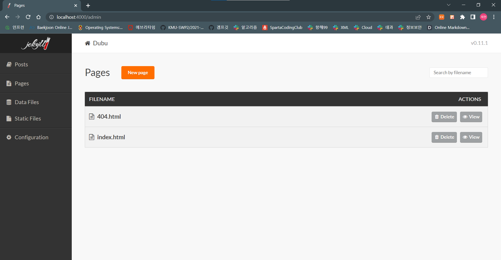

이 포스트는 Jekyll admin을 적용하는 과정을 설명한다.

-------------------------------------------------------------------------

## Jekyll admin 설치

Jekyll admin은 사용자의 편의성을 위해 Markdown 언어를 사용하지 않고

인터페이스를 통해 블로그를 관리할 수 있게 만든 기능이다.

Jekyll admin을 배포하는 Git의 Readme를 보면 Jekyll admin을 사용하기 위해선 
Gemfile에 플러그인을 추가하라고 나와있다.

https://github.com/jekyll/jekyll-admin

이를 위해 Gemfile을 VS Code로 실행하여 마지막 줄에 

`gem 'jekyll-admin', group: :jekyll_plugins`

를 추가했다.

이후엔 `bundle install` 을 jekyll이 설치된 directory에서 실행해주면 설치는 완료가 된다.

---------------------------------------------------------------------------------------
## Jekyll admin 실행

jekyll admin은 평소처럼 `bundle exec jekyll serve`를 통해 jekyll을 실행 하고

`http://localhost:4000/admin`에 브라우저로 접속을 하여 시작할 수 있다.

이후 Post나 Page를 각각의 탭에서 인터페이스를 통해  쉽게 만들 수가 있다.

하지만 나 같은 경우 이렇게 POST를 하면, Post의 front-matter에 title 밖에 생기지 않아 theme가 적용되지 않았다. 

따라서 VS code를 통해 추가로 수정을 해주어야 했다.